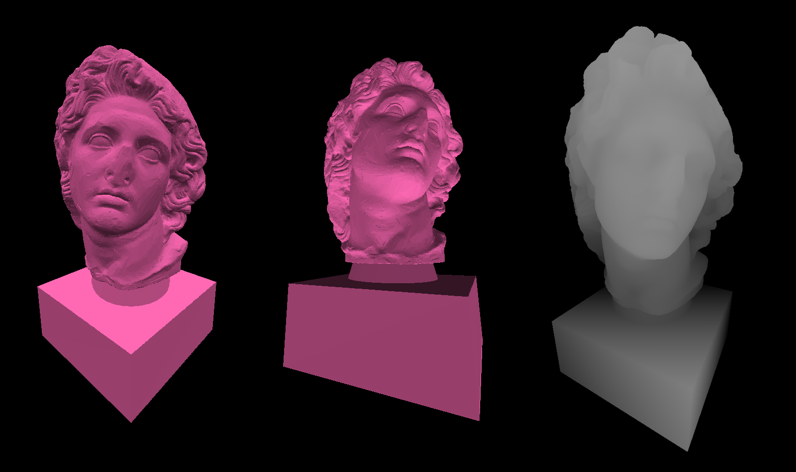
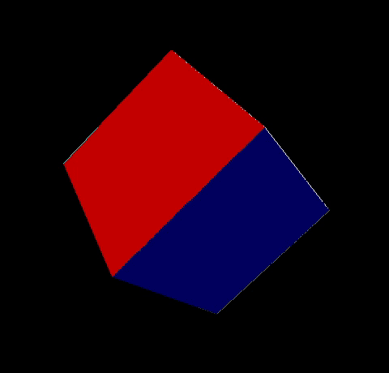

# Elafri

### An Engine focused on Simplicity

Elafri is a free and open source oversimplistic and multi-environment Engine.
This Engine is written in C and is ported to the Terminal and SDL.
It is meant to provide very minimalistic features you can build upon for light programs.
The vision is to make everything as simple as possible (one action = one function).

I have purposely kept the linecount very low to make it easy to go through and
I've made the Engine's components modular (you need to include something to use it).
This makes things much easier and also allows you to easily tinker with any part of
the Engine that you're using.

#### People who can most benefit are those who:

* want to make simple lightweight programs
* are fine with minimalistic features
* just want the job done (play audio, draw an object, etc...)

## Instructions

To use Elafri, you:

* first need to select a port (Terminal, SDL, etc...)
* go into that folder (ex. src/Terminal/)
* get all the files (main.c is an example program)
* to use some addon like 3D or file reading, you take those files from src/

### 3D Cube rendered in Elafri

## Design philosophy

Elafri is designed with simplicity and developer freedom in mind.
The Engine does not make the code you write run on top of it or inside it.
Instead, the developer is the one who invokes Elafri and choses what code runs
and when it runs. The entire project aims to keep a low line count for the main
files as well as all the extensions. Due to the minimalistic nature of it,
I also don't go too much into error handling. If you do something really
dumb, don't expect my function to return -1, it will likely just crash.

## Documentation

Since this Engine has not gotten much attention, I haven't felt the need to
write an exhaustive documentation but I may do it in the future.
Feel free to contact me for any questions.

## Contact Information

- Email: niko7V@proton.me
- Discord: niko64
- Matrix: @niko:catgirl.cloud

## Donations

I do not expect donations but if you wish to support Elafri, you can contact me
for details.
